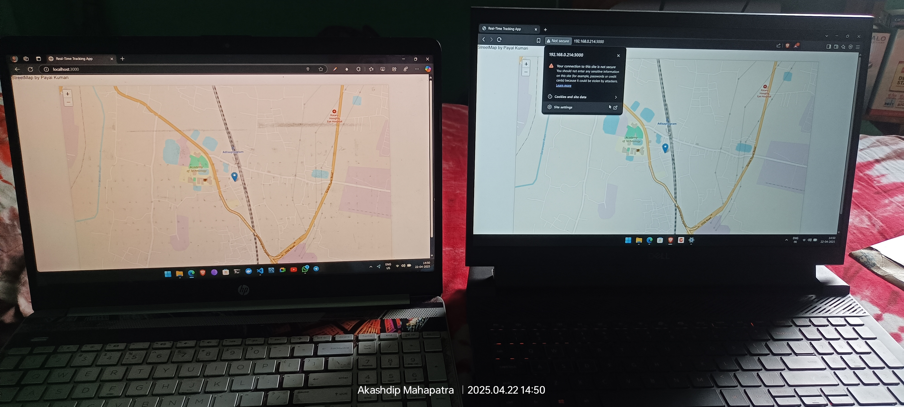
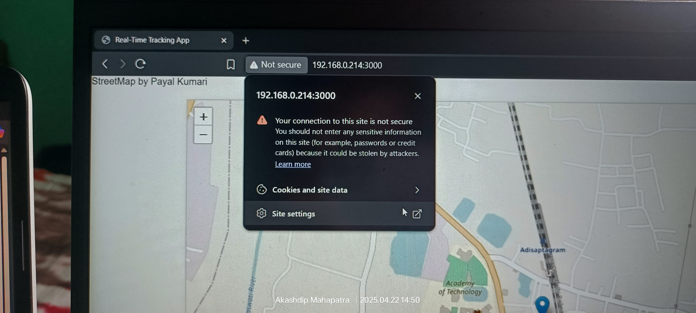

# Realtime Device Tracker

A real-time device tracking application built with Node.js, Express, Socket.IO, and Leaflet. This application allows users to track their devices' locations on a map in real-time using geolocation.

## Features

- Real-time location tracking using WebSocket.
- Interactive map interface using Leaflet.
- Custom markers for user locations.
- Dynamic tooltips displaying user IDs.
- Responsive design with smooth user experience.

## Technologies Used

- **Node.js**: JavaScript runtime for building the server.
- **Express**: Web framework for Node.js.
- **Socket.IO**: Enables real-time bidirectional communication between clients and server.
- **Leaflet**: Open-source JavaScript library for interactive maps.
- **HTML/CSS**: For the frontend structure and styling.

## Getting Started

### 🔵 Prerequisites

- Node.js installed on your machine.
- npm (Node package manager).

To run the application with automatic reloading, use `nodemon`:

1. Make sure you have `nodemon` installed globally:
   ```bash
   npm install -g nodemon

   Start the application:
   npx nodemon app.js

### 🟢 **If you face any errore to Run** (For New Systems)

#### 1. **Install Prerequisites**
Make sure you have the following installed:
- [Node.js](https://nodejs.org/) (LTS version recommended)
- npm (comes with Node.js)

To verify:
```bash
node -v
npm -v
```

---

#### 2. **Clone the Project**
```bash
git clone https://github.com/PayalKumari10/Realtime_Tracker.git
cd Realtime_Tracker
```

---

#### 3. **Set Your Git Identity (Optional, for commits)**
```bash
git config user.name "your_github_username"
git config user.email "your_email@example.com"
```

---

#### 4. **Install Project Dependencies**
```bash
npm install
```

---

#### 5. **(Optional) Install nodemon Globally for Auto-Restart**
```bash
npm install -g nodemon
```

---

#### 6. **Start the App**
```bash
npx nodemon app.js
```

If `nodemon` isn't installed, you can just run:
```bash
node app.js
```

---

#### 7. **Open the App**
Open your browser and go to:
```
http://localhost:3000
```
<p align="center">
  
  
</p>

---
---

## Update for `local network access`

```js
app.listen(3000, "0.0.0.0", () => {
  console.log("Server is running on http://<your_ip>:3000");
});
```


#### But the Browser default feature Block the `Location` because of `http` (not Secure)

<p align="center">
  
  
</p>

https://github.com/user-attachments/assets/9ff3b1a1-7929-4381-890e-8a1058d3c269

[Watch the video of updated features in 22-04-2025](./public/images/videos/updated%20features%2022-04-2025.mp4)

---


> **"Location error: Only secure origins are allowed..."**

...happens because **modern browsers block geolocation on insecure origins** (like `http://192.168.x.x`) **unless it's**:
- **Served over HTTPS**
- **Or running on `localhost`**

---

### 🛠️ 🔒 Quick Workarounds (For Development Only)

#### ✅ Option 1: Use `localhost` on the target device
If you're testing on a **mobile device**, access your server using:
```
http://localhost:3000
```
This only works if the server is running on the mobile device **itself**.

---

#### ✅ Option 2: Use HTTPS via a tunneling service

Use [**ngrok**](https://ngrok.com/) or [**localtunnel**](https://github.com/localtunnel/localtunnel) to expose your local dev server over HTTPS.

**Ngrok example:**

1. Run your local server:
   ```bash
   npm start
   ```

2. In another terminal, run:
   ```bash
   ngrok http 3000
   ```

3. Ngrok gives you an `https://` URL → open that on your mobile and geolocation will work fine.

---

#### ✅ Option 3: Enable insecure origins in **Chrome (only for testing)**

If you're testing on **Chrome** on **Android**, launch with this flag **(PC only)**:

```bash
chrome.exe --unsafely-treat-insecure-origin-as-secure="http://192.168.0.214:3000" --user-data-dir=/test-profile --disable-web-security
```

⚠️ **Only for dev/debug use** – never in production!
